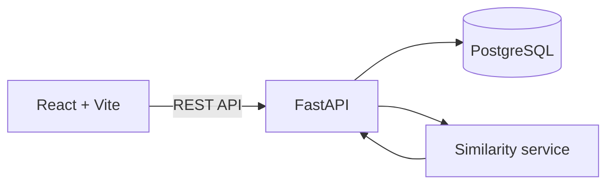

# STOW — Smart Inventory Assistant

> Know what you own. Buy only what you need.

STOW is a personal inventory and purchase-decision assistant that helps people avoid duplicate purchases and notice low-stock items before they run out. It combines a clear inventory workspace with an explainable similarity score, so every recommendation shows exactly how it was calculated.

## Why STOW?

People often buy something and later realize they already own a similar item. They also discover that everyday supplies are empty only when they need them. Existing inventory tools record possessions, but recording alone does not help with the next decision.

STOW connects three questions in one workflow:

1. **What do I already own?**
2. **Should I buy this?**
3. **What needs to be restocked?**

## Core features

- **Personal inventory** — create, edit, delete, search, and filter items.
- **Purchase Check** — compare a potential purchase with existing inventory.
- **Explainable scoring** — display the contribution of every matched feature.
- **Restock queue** — set a threshold for each item and see what needs attention.
- **Quick stock updates** — add one unit directly from the restock view.
- **Persistent data** — store inventory and evaluations in PostgreSQL.
- **International interface** — a fully English editorial SaaS experience.
- **Docker development environment** — start the complete stack with one command.

## How Purchase Check works

STOW extracts a small set of comparable product features and applies a transparent weighted score. The current MVP uses deterministic matching, making its recommendations predictable and easy to audit.

| Feature | Weight |
|---|---:|
| Category | 30% |
| Color | 30% |
| Style | 15% |
| Material | 15% |
| Purpose | 10% |
| **Total** | **100%** |

The item with the highest score becomes the closest match. STOW then returns a recommendation and a plain-English explanation. For example, a candidate that matches category, color, style, and material—but not purpose—receives a score of 90%.

## Recommendation bands

| Similarity | Result | Meaning |
|---|---|---|
| 70–100% | Skip this one | A close alternative already exists in the inventory. |
| 40–69% | Consider first | Review the closest item before deciding. |
| 0–39% | Good to consider | No strong duplicate was found. |

## Architecture



| Layer | Technology | Responsibility |
|---|---|---|
| Frontend | React, Vite | Inventory, purchase check, and restock experience |
| Backend | Python, FastAPI | REST endpoints, validation, and recommendation logic |
| Database | PostgreSQL, SQLAlchemy | Users, items, and purchase evaluations |
| Migrations | Alembic | Database schema versioning |
| Environment | Docker Compose | Reproducible local development stack |

## Project structure

```text
smart-inventory-assistant/
├── backend/
│   ├── alembic/          # Database migrations
│   ├── app/
│   │   ├── models/       # SQLAlchemy models
│   │   ├── routers/      # FastAPI endpoints
│   │   ├── schemas/      # Request and response validation
│   │   └── services/     # Similarity and recommendation logic
│   └── tests/            # API and service tests
├── frontend/
│   └── src/              # React application and styles
├── docker-compose.yml
└── .env.example
```

## Run locally

### Requirements

- Docker Desktop
- Docker Compose

### Start the application

```bash
git clone https://github.com/MAY0927/smart-inventory-assistant.git
cd smart-inventory-assistant
cp .env.example .env
docker compose up --build
```

On Windows PowerShell, copy the environment file with:

```powershell
Copy-Item .env.example .env
```

Then open:

- Frontend: [http://localhost:5173](http://localhost:5173)
- API documentation: [http://localhost:8000/docs](http://localhost:8000/docs)
- Health check: [http://localhost:8000/health](http://localhost:8000/health)

Stop the stack with:

```bash
docker compose down
```

## Test

With the Docker services running:

```bash
docker compose exec backend pytest -v
```

Current result: **7 tests passed**. The suite covers inventory CRUD, validation, purchase evaluation, and all three recommendation bands.

Build the frontend for production:

```bash
docker compose exec frontend npm run build
```

## API overview

| Method | Endpoint | Purpose |
|---|---|---|
| `GET` | `/health` | Check API availability |
| `GET` | `/items` | List, search, and filter inventory |
| `POST` | `/items` | Create an inventory item |
| `GET` | `/items/{item_id}` | Retrieve one item |
| `PATCH` | `/items/{item_id}` | Update item details or stock |
| `DELETE` | `/items/{item_id}` | Delete an item |
| `POST` | `/purchase-evaluations` | Compare a candidate purchase with inventory |

## Restock logic

Each item has its own restock threshold. An item enters the Restock queue when:

```text
quantity <= restock threshold
```

The threshold is stored alongside the item's flexible attributes, so users can customize it without changing the inventory workflow.

## Development process

This project was built through a branch-based workflow with focused commits and pull requests. Major milestones include:

- Project scope and technical plan
- Docker development environment
- PostgreSQL models and Alembic migration
- Inventory CRUD API
- Inventory dashboard
- Purchase recommendation engine
- International UI redesign
- Configurable restock reminders

## Roadmap

- Image-assisted item tagging
- Optional LLM-generated recommendation explanations
- Usage history and predicted depletion dates
- Authentication and multiple user accounts
- Shopping-list integration
- Deployment and responsive mobile experience

## Team

- **May (MAY0927)** — product concept, development, testing, and interface design
- **Howard (Howardleejhenhao)** — technical collaboration and code review

## License

This project is currently provided for educational and competition use.
