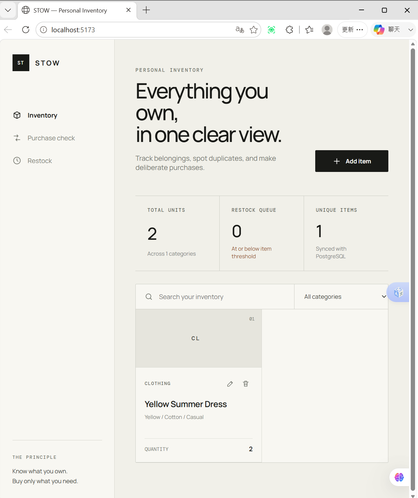
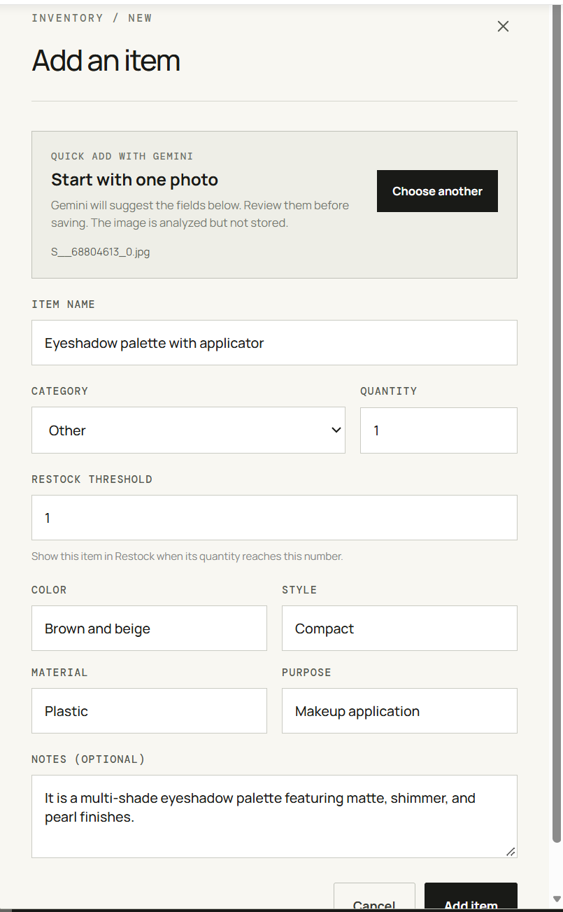
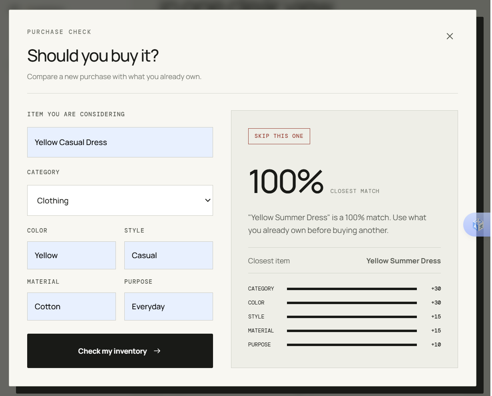
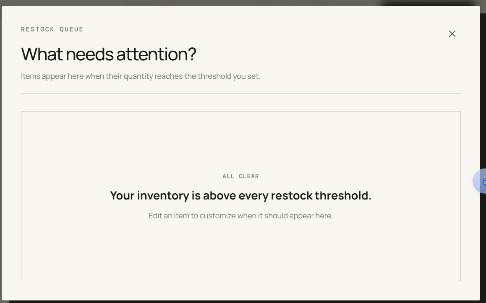
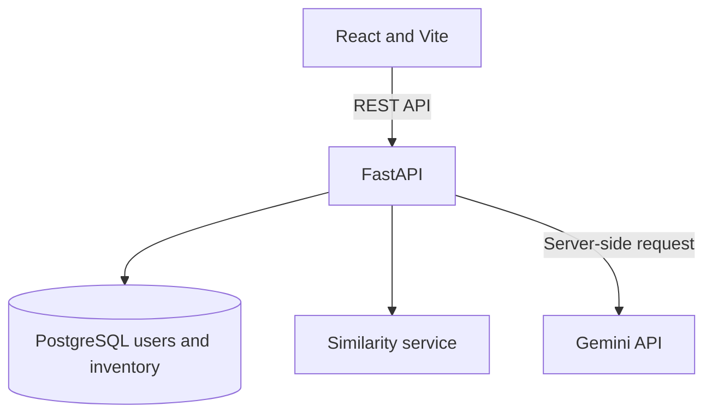

# STOW — Smart Inventory Assistant

> Know what you own. Buy only what you need.

STOW is an AI-assisted personal inventory and purchase-decision tool. It helps people remember what they own, add items from a single photo, avoid duplicate purchases, and restock essentials at the right time.

## The problem

It is easy to find something appealing in a store and forget that a similar item is already at home. It is just as easy to discover that an everyday essential has run out only when it is needed. Traditional inventory tools can record possessions, but recording alone does not support the next decision.

STOW connects three practical questions in one workflow:

1. **What do I already own?**
2. **Should I buy this?**
3. **What needs to be restocked?**

## Product preview

### One clear inventory view



### Quick Add with Gemini

Upload one product photo and review the structured English suggestions before saving. The uploaded image is analyzed but not stored.



### A purchase decision you can understand



### A focused restock queue



## Core features

- **Personal inventory** — create, edit, delete, search, and filter items.
- **Quick Add with Gemini** — analyze one product image and suggest the item name, category, color, style, material, purpose, and notes.
- **Review before saving** — AI output only pre-fills the form; the user remains in control of the final record.
- **Purchase Check** — compare a potential purchase with every existing inventory item.
- **Explainable scoring** — show the contribution of every matched feature instead of returning a black-box result.
- **Restock queue** — set a threshold for each item and see what needs attention.
- **Quick stock updates** — add one unit directly from the restock view.
- **Persistent data** — store inventory and purchase evaluations in PostgreSQL.
- **Private accounts** — protect team and judge inventories with Argon2 password hashes and expiring access tokens.
- **English editorial interface** — present a focused experience for an international audience.
- **Reproducible environment** — run the React frontend, FastAPI backend, and PostgreSQL database with Docker Compose.

## Quick Add with Gemini

Quick Add reduces the effort required to create an inventory record:

1. The user selects one JPEG, PNG, or WebP image up to 8 MB.
2. FastAPI validates the file before sending it to the Gemini API.
3. Gemini returns structured English fields that match the inventory schema.
4. STOW pre-fills the form and asks the user to review the suggestions.
5. Only the confirmed form data is saved to PostgreSQL.

The original image is not stored. The Gemini API key is used only by the backend and is loaded from an environment variable; it is never included in frontend code or committed to the repository.

## Explainable Purchase Check

STOW applies a deterministic weighted score so that recommendations remain predictable and auditable.

| Feature | Weight |
|---|---:|
| Category | 30% |
| Color | 30% |
| Style | 15% |
| Material | 15% |
| Purpose | 10% |
| **Total** | **100%** |

The highest-scoring inventory item becomes the closest match. STOW returns its score, recommendation, plain-English explanation, and the contribution of every feature.

| Similarity | Result | Meaning |
|---|---|---|
| 70–100% | Skip this one | A close alternative already exists. |
| 40–69% | Consider first | Review the closest item before deciding. |
| 0–39% | Good to consider | No strong duplicate was found. |

## Architecture



| Layer | Technology | Responsibility |
|---|---|---|
| Frontend | React, Vite | Inventory, image-assisted intake, purchase check, and restock experience |
| Backend | Python, FastAPI | REST endpoints, validation, Gemini integration, and recommendation logic |
| Database | PostgreSQL, SQLAlchemy | Users, items, and purchase evaluations |
| Migrations | Alembic | Database schema versioning |
| AI service | Google Gemini API | Structured suggestions from a single product image |
| Environment | Docker Compose | Reproducible three-service development stack |
| Testing | Pytest | API validation, CRUD flows, and recommendation behavior |

## Project structure

```text
smart-inventory-assistant/
├── backend/
│   ├── alembic/          # Database migrations
│   ├── app/
│   │   ├── models/       # SQLAlchemy models
│   │   ├── routers/      # FastAPI endpoints
│   │   ├── schemas/      # Request and response validation
│   │   └── services/     # Similarity and Gemini services
│   └── tests/            # API and service tests
├── docs/screenshots/     # Product images used in this README
├── frontend/src/         # React application and styles
├── docker-compose.yml
└── .env.example
```

## Run locally

### Requirements

- Git
- Docker Desktop with Docker Compose
- A Gemini API key for image-assisted intake

The inventory, Purchase Check, and Restock features can still run without a Gemini API key. Only image analysis requires it.

### 1. Clone the repository

```bash
git clone https://github.com/MAY0927/smart-inventory-assistant.git
cd smart-inventory-assistant
```

### 2. Create the local environment file

macOS or Linux:

```bash
cp .env.example .env
```

Windows PowerShell:

```powershell
Copy-Item .env.example .env
```

Open `.env` and replace the placeholder with your own key:

```env
GEMINI_API_KEY=your_gemini_api_key_here
GEMINI_MODEL=gemini-3.5-flash-lite
JWT_SECRET=replace_with_a_random_secret_of_at_least_32_characters
```

Generate a strong JWT secret in PowerShell with:

```powershell
[Convert]::ToBase64String((1..48 | ForEach-Object { Get-Random -Maximum 256 }))
```

Never commit `.env` or a real API key. The tracked `.env.example` contains placeholders only.

### 3. Start the application

```bash
docker compose up --build
```

In a second terminal, create the two invited accounts. Passwords are entered through a hidden prompt and only Argon2 hashes are stored in PostgreSQL:

```bash
docker compose exec backend python -m app.create_user --email team@stow.demo --role team
docker compose exec backend python -m app.create_user --email judge@stow.demo --role judge
```

Do not put account passwords in `.env`, source code, commits, the README, or the public Devpost page. Share the judge credentials privately with the organizers.

Open:

- Frontend: [http://localhost:5173](http://localhost:5173)
- API documentation: [http://localhost:8000/docs](http://localhost:8000/docs)
- Health check: [http://localhost:8000/health](http://localhost:8000/health)

Stop the stack with:

```bash
docker compose down
```

If a port is already allocated, stop the older Compose project before starting this one.

## Test

With the Docker services running:

```bash
docker compose exec backend pytest -v
```

The suite covers authentication, protected routes, image-upload validation, inventory CRUD, required-field validation, purchase evaluation, and all three recommendation bands.

Build the frontend for production:

```bash
docker compose exec frontend npm run build
```

## API overview

| Method | Endpoint | Purpose |
|---|---|---|
| `GET` | `/health` | Check API availability |
| `POST` | `/auth/login` | Sign in and receive an expiring access token |
| `GET` | `/auth/me` | Read the authenticated account |
| `GET` | `/items` | List, search, and filter inventory |
| `POST` | `/items` | Create an inventory item |
| `GET` | `/items/{item_id}` | Retrieve one item |
| `PATCH` | `/items/{item_id}` | Update item details or stock |
| `DELETE` | `/items/{item_id}` | Delete an item |
| `POST` | `/purchase-evaluations` | Compare a candidate purchase with inventory |
| `POST` | `/image-intake/analyze` | Validate and analyze one product image |

## Restock logic

Each item has its own restock threshold. It enters the Restock queue when:

```text
quantity <= restock threshold
```

The threshold is stored with the item's flexible attributes, allowing users to customize restocking without adding a separate workflow.

## Development journey

STOW was built during FirstCommit through focused feature branches, meaningful commits, pull requests, reviews, and merges. Major milestones included:

- Defining the product problem and technical plan
- Creating a Docker Compose development environment
- Designing PostgreSQL models and an Alembic migration
- Building and validating the inventory CRUD API
- Connecting the React interface to real persisted data
- Designing an explainable purchase recommendation engine
- Reworking the product into a fully English editorial interface
- Adding configurable restock thresholds and quick stock updates
- Integrating server-side Gemini image analysis with structured output
- Adding database-backed team and judge accounts with Argon2 password hashing
- Protecting secrets with local environment configuration
- Expanding the backend suite to nine passing tests

## Challenges and lessons

- **Explainability over novelty** — a transparent scoring system made purchase recommendations easier to understand and defend.
- **Full-stack coordination** — API schemas, database models, and React form state had to evolve together.
- **Reproducible development** — Docker reduced setup differences, while port conflicts taught us how to identify and stop older projects safely.
- **Safe AI integration** — the Gemini key stays server-side, images are validated, and users must review suggestions before saving.
- **Reliable structured output** — a constrained prompt and JSON schema turn a generative response into predictable form data.
- **Collaborative Git practice** — feature branches, reviews, and conflict resolution preserved a clear development history.
- **International presentation** — rewriting the interface in English made both the product and its purpose clearer to the hackathon audience.

## AI usage disclosure

Google Gemini is an application feature used to analyze a user-selected product image and suggest structured inventory fields. The suggestions are displayed for review and are never saved automatically.

AI tools were also used during development for brainstorming, learning, debugging, UI copy refinement, and code review. All generated suggestions and code changes were reviewed, tested, and understood by the contributors. Product decisions, integration work, testing, and final implementation remained the responsibility of the team.

## Credits and external resources

- [Google Gemini API](https://ai.google.dev/) — image analysis and structured field suggestions
- [FastAPI](https://fastapi.tiangolo.com/) — backend API framework
- [React](https://react.dev/) and [Vite](https://vite.dev/) — frontend application
- [PostgreSQL](https://www.postgresql.org/), [SQLAlchemy](https://www.sqlalchemy.org/), and [Alembic](https://alembic.sqlalchemy.org/) — persistence and migrations
- [Docker](https://www.docker.com/) — local multi-service environment
- [Pytest](https://pytest.org/) — backend testing

All product screenshots and project-specific code in this repository were created for STOW. The product image used to verify Quick Add was supplied by the team for testing.

## Team

- **May ([MAY0927](https://github.com/MAY0927))** — product concept, full-stack feature development, Gemini integration, testing, documentation, and interface design
- **Howard ([Howardleejhenhao](https://github.com/Howardleejhenhao))** — technical collaboration, code review, deployment, and production configuration

## Roadmap

- Authentication and separate inventories for multiple users
- Rate limiting and additional production safeguards
- Optional image storage controlled by the user
- More inventory categories, including Beauty
- Usage history and predicted depletion dates
- Shopping-list integration
- A dedicated responsive mobile experience

## License

This project is provided for educational and hackathon evaluation purposes.
